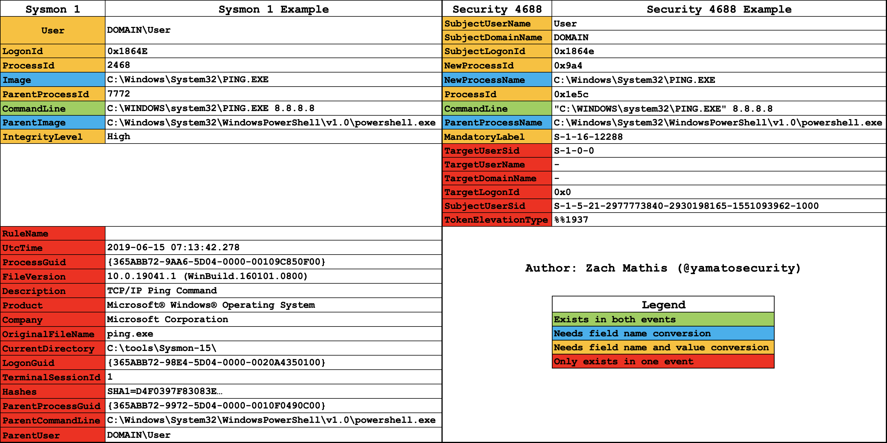
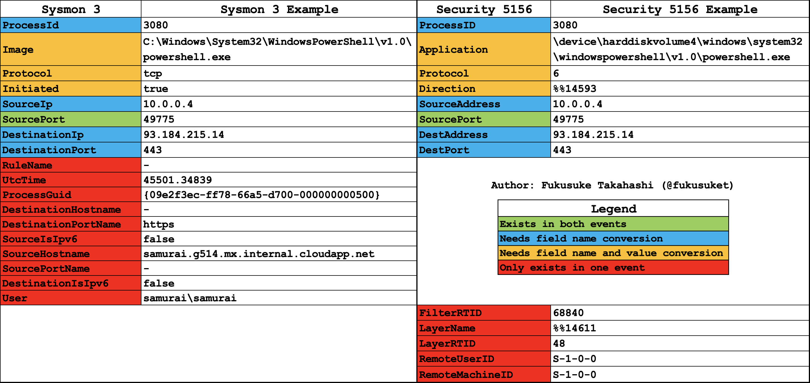

# Curation of Sigma Rules for Windows Event Logs

[**English**] | [\[日本語\]](README-Japanese.md)

[](https://www.python.org/)


# Table of Contents

- [Curation of Sigma Rules for Windows Event Logs](#curation-of-sigma-rules-for-windows-event-logs)
- [Table of Contents](#table-of-contents)
- [About this repository](#about-this-repository)
- [TLDR](#tldr)
- [Challenges with upstream Sigma rules for Windows event logs](#challenges-with-upstream-sigma-rules-for-windows-event-logs)
  - [About the `logsource` field](#about-the-logsource-field)
    - [Service fields](#service-fields)
      - [Single channel example:](#single-channel-example)
      - [Multiple channel example:](#multiple-channel-example)
      - [Current list of service mappings](#current-list-of-service-mappings)
      - [Service mapping sources](#service-mapping-sources)
    - [Category fields](#category-fields)
      - [Category field example:](#category-field-example)
      - [Current list of category mappings](#current-list-of-category-mappings)
      - [Category field challenges](#category-field-challenges)
      - [Category mapping sources](#category-mapping-sources)
- [Benefits and challenges of abstracting the log source](#benefits-and-challenges-of-abstracting-the-log-source)
  - [Log source abstraction benefits:](#log-source-abstraction-benefits)
  - [Log source abstraction challenges:](#log-source-abstraction-challenges)
- [Conversion example](#conversion-example)
  - [Before conversion](#before-conversion)
  - [After conversion](#after-conversion)
- [Conversion commonalities](#conversion-commonalities)
- [Conversion limitations](#conversion-limitations)
- [Sysmon and built-in event comparison and rule conversion](#sysmon-and-built-in-event-comparison-and-rule-conversion)
  - [Process creation](#process-creation)
    - [Comparison:](#comparison)
    - [Conversion notes:](#conversion-notes)
    - [Other notes:](#other-notes)
    - [Built-in log settings](#built-in-log-settings)
      - [Enabling with group policy](#enabling-with-group-policy)
      - [Enabling on the command line](#enabling-on-the-command-line)
  - [Network connection](#network-connection)
    - [Comparison:](#comparison-1)
    - [Conversion notes:](#conversion-notes-1)
    - [Built-in log settings](#built-in-log-settings-1)
      - [Enabling with group policy](#enabling-with-group-policy-1)
      - [Enabling on the command line](#enabling-on-the-command-line-1)
- [Sigma rule writing advice](#sigma-rule-writing-advice)
- [Pre-converted Sigma rules](#pre-converted-sigma-rules)
- [Tool Environment](#tool-environment)
- [Tool usage](#tool-usage)
- [Authors](#authors)


# About this repository

This repository contains documentation of how Yamato Security curates upstream [Sigma](https://github.com/SigmaHQ/sigma) rules for Windows event logs into a more usable form by deabstracting the `logsource` field and filtering out any rules that are determined to be unsable or hard to use with the tool `sigma-to-hayabusa-converter.py`.
This tool is used mainly for creating the curated Sigma ruleset hosted at [https://github.com/Yamato-Security/hayabusa-rules](https://github.com/Yamato-Security/hayabusa-rules) which is used by [Hayabusa](https://github.com/Yamato-Security/hayabusa) and [Velociraptor](https://github.com/Velocidex/velociraptor)
We hope this information may be useful for other projects that are trying to use Sigma rules for detecting attacks in Windows event logs.

# TLDR

* Deabstracting the `logsource` field and creating new `.yml` rule files for built-in rules as well as the original Sysmon-based rules makes full built-in event support for Sigma rules easier and reading the rules easier for analysts.
* When writing Sigma rules for Windows event logs, it is important to understand the differences between the original Sysmon-based logs and the compatible built-in logs and ideally write your rules so they are compatible with both.
* Many organizations cannot or do not want to install and maintain Sysmon agents on all of their Windows endpoints because they do not have the dedicated resources to handle it or they want to avoid the risk of any slow downs or crashes caused by Sysmon. Because of this, it is important to enable as many built-in event logs as well as use tools that can handle detecting attacks in those built-in logs.


# Challenges with upstream Sigma rules for Windows event logs

The main challenge for creating a native Sigma rule parser for Windows event logs, in our experience, has been to support the `logsource` field.
Currently, this is one of the few things that Hayabusa does not support natively yet as this is still very complex and a work in progress.
For the time being, we are getting around this by converting the upstream rules into an easier-to-use format as explained in detail in this document.

## About the `logsource` field

In Sigma rules for Windows event logs, the `product` field is set to `windows` followed by either a `service` field or `category` field.

`service` field example:
```
logsource:
    product: windows
    service: application
```

`category` field example:
```
logsource:
    product: windows
    category: process_creation
```

### Service fields

`service` fields are relatively simple to handle and tells whatever backend using the Sigma rule to search for a single channel or multiple channels based on the `Channel` field in the Windows XML event log.

#### Single channel example:
`service: application` is the same thing as adding a selection condition of `Channel: Application` to the Sigma rule.

#### Multiple channel example:
`service: applocker` currently creates the most amount of multiple channels to search through as Applocker will save information in four different logs. In order to properly search just the Applocker logs, the following condition needs to be added to the Sigma rule logic:
```
Channel:
    - Microsoft-Windows-AppLocker/MSI and Script
    - Microsoft-Windows-AppLocker/EXE and DLL
    - Microsoft-Windows-AppLocker/Packaged app-Deployment
    - Microsoft-Windows-AppLocker/Packaged app-Execution
``` 

#### Current list of service mappings

| Service                                 | Channel                                                                                               |
|-----------------------------------------|-------------------------------------------------------------------------------------------------------|
| application                             | Application                                                                                           |
| application-experience                  | Microsoft-Windows-Application-Experience/Program-Telemetry, Microsoft-Windows-Application-Experience/Program-Compatibility-Assistant |
| applocker                               | Microsoft-Windows-AppLocker/MSI and Script, Microsoft-Windows-AppLocker/EXE and DLL, Microsoft-Windows-AppLocker/Packaged app-Deployment, Microsoft-Windows-AppLocker/Packaged app-Execution |
| appmodel-runtime                        | Microsoft-Windows-AppModel-Runtime/Admin                                                              |
| appxpackaging-om                        | Microsoft-Windows-AppxPackaging/Operational                                                           |
| bits-client                             | Microsoft-Windows-Bits-Client/Operational                                                             |
| capi2                                   | Microsoft-Windows-CAPI2/Operational                                                                   |
| certificateservicesclient-lifecycle-system | Microsoft-Windows-CertificateServicesClient-Lifecycle-System/Operational                               |
| codeintegrity-operational               | Microsoft-Windows-CodeIntegrity/Operational                                                           |
| diagnosis-scripted                      | Microsoft-Windows-Diagnosis-Scripted/Operational                                                      |
| dhcp                                    | Microsoft-Windows-DHCP-Server/Operational                                                             |
| dns-client                              | Microsoft-Windows-DNS Client Events/Operational                                                       |
| dns-server                              | DNS Server                                                                                            |
| dns-server-analytic                     | Microsoft-Windows-DNS-Server/Analytical                                                               |
| driver-framework                        | Microsoft-Windows-DriverFrameworks-UserMode/Operational                                               |
| firewall-as                             | Microsoft-Windows-Windows Firewall With Advanced Security/Firewall                                     |
| hyper-v-worker                          | Microsoft-Windows-Hyper-V-Worker                                                                      |
| kernel-event-tracing                    | Microsoft-Windows-Kernel-EventTracing                                                                 |
| kernel-shimengine                       | Microsoft-Windows-Kernel-ShimEngine/Operational, Microsoft-Windows-Kernel-ShimEngine/Diagnostic       |
| ldap_debug                              | Microsoft-Windows-LDAP-Client/Debug                                                                   |
| lsa-server                              | Microsoft-Windows-LSA/Operational                                                                     |
| microsoft-servicebus-client             | Microsoft-ServiceBus-Client                                                                           |
| msexchange-management                   | MSExchange Management                                                                                 |
| ntfs                                    | Microsoft-Windows-Ntfs/Operational                                                                    |
| ntlm                                    | Microsoft-Windows-NTLM/Operational                                                                    |
| openssh                                 | OpenSSH/Operational                                                                                   |
| powershell                              | Microsoft-Windows-PowerShell/Operational, PowerShellCore/Operational                                  |
| powershell-classic                      | Windows PowerShell                                                                                    |
| printservice-admin                      | Microsoft-Windows-PrintService/Admin                                                                  |
| printservice-operational                | Microsoft-Windows-PrintService/Operational                                                            |
| security                                | Security                                                                                              |
| security-mitigations                    | Microsoft-Windows-Security-Mitigations*                                                               |
| shell-core                              | Microsoft-Windows-Shell-Core/Operational                                                              |
| smbclient-connectivity                  | Microsoft-Windows-SmbClient/Connectivity                                                              |
| smbclient-security                      | Microsoft-Windows-SmbClient/Security                                                                  |
| system                                  | System                                                                                                |
| sysmon                                  | Microsoft-Windows-Sysmon/Operational                                                                  |
| taskscheduler                           | Microsoft-Windows-TaskScheduler/Operational                                                           |
| terminalservices-localsessionmanager    | Microsoft-Windows-TerminalServices-LocalSessionManager/Operational                                    |
| vhdmp                                   | Microsoft-Windows-VHDMP/Operational                                                                   |
| wmi                                     | Microsoft-Windows-WMI-Activity/Operational                                                            |
| windefend                               | Microsoft-Windows-Windows Defender/Operational                                                        |


#### Service mapping sources

We have created YAML mapping files for services to channel names which we periodcially maintain and host in this repository.
They are based on the service mapping information from [https://github.com/SigmaHQ/sigma/blob/master/tests/thor.yml](https://github.com/SigmaHQ/sigma/blob/master/tests/thor.yml) as although this does not seem to be an offical generic config file for people to use, it seems to be the most up-to-date.

### Category fields

Most `category` fields will just add a condition to check for certain event IDs in the `EventID` field in addition to searching for a specific `Channel`.
The category names are mostly based off of [Sysmon](https://learn.microsoft.com/en-us/sysinternals/downloads/sysmon) events with some additional categories for built-in PowerShell logs and Windows Defender.

#### Category field example:

```
process_creation:
    EventID: 1
    Channel: Microsoft-Windows-Sysmon/Operational
```

#### Current list of category mappings

| Category                     | Service             | EventIDs                                        |
|------------------------------|---------------------|-------------------------------------------------|
| antivirus                    | windefend           | 1006, 1007, 1008, 1009, 1010, 1011, 1012, 1017, 1018, 1019, 1115, 1116 |
| clipboard_change             | sysmon              | 24                                              |
| create_remote_thread         | sysmon              | 8                                               |
| create_stream_hash           | sysmon              | 15                                              |
| dns_query                    | sysmon              | 22                                              |
| driver_load                  | sysmon              | 6                                               |
| file_block_executable        | sysmon              | 27                                              |
| file_block_shredding         | sysmon              | 28                                              |
| file_change                  | sysmon              | 2                                               |
| file_creation                | sysmon              | 11                                              |
| file_delete                  | sysmon              | 23, 26                                          |
| file_delete_detected         | sysmon              | 26                                              |
| file_executable_detected     | sysmon              | 29                                              |
| image_load                   | sysmon              | 7                                               |
| **network_connection**       | sysmon              | 3                                               |
| **network_connection**       | security            | 5156                                            |
| pipe_created                 | sysmon              | 17, 18                                          |
| process_access               | sysmon              | 10                                              |
| **process_creation**         | sysmon              | 1                                               |
| **process_creation**         | security            | 4688                                            |
| process_tampering            | sysmon              | 25                                              |
| process_termination          | sysmon              | 5                                               |
| ps_classic_provider_start    | powershell-classic  | 600                                             |
| ps_classic_start             | powershell-classic  | 400                                             |
| ps_module                    | powershell          | 4103                                            |
| ps_script                    | powershell          | 4104                                            |
| raw_access_thread            | sysmon              | 9                                               |
| **registry_add**             | sysmon              | 12                                              |
| **registry_add**             | security            | 4657                                            |
| registry_delete              | sysmon              | 12                                              |
| **registry_event**           | sysmon              | 12, 13, 14                                      |
| **registry_event**           | security            | 4657                                            |
| registry_rename              | sysmon              | 14                                              |
| **registry_set**             | sysmon              | 13                                              |
| **registry_set**             | security            | 4657                                            |
| sysmon_error                 | sysmon              | 255                                             |
| sysmon_status                | sysmon              | 4, 16                                           |
| wmi_event                    | sysmon              | 19, 20, 21                                      |

#### Category field challenges

You may have noticed that the same `category` can use multiple services and event IDs (**※indicated in bold**). 
That means that it is possible to use some Sigma rules designed for `sysmon` with similar built-in Windows `security` event logs if the fields that the rule uses also exist in the built-in event log.
In that case, the field names and sometimes also the values may need to be converted to match the field names and values of the built-in `security` event log.
Although this may be as simple as renaming some field names for certain categories, for other categories this may require various conversions in field values as well.
How we do this conversion and the compatibility between `sysmon` logs and `security` logs are explained in detail later in this document.

#### Category mapping sources

The YAML mapping files for categories are also hosted in this repository and are also based on the information from [https://github.com/SigmaHQ/sigma/blob/master/tests/thor.yml](https://github.com/SigmaHQ/sigma/blob/master/tests/thor.yml).

# Benefits and challenges of abstracting the log source

There are benefits and challenges due to abstracting the log source and creating mappings for different `Channel`, `EventID` and fields on the backend.

## Log source abstraction benefits:

1. It may be easier to convert the `Channel` and `EventID` fieldnames to the proper backend field names when converting Sigma rules to other backend queries.
2. It is possible to consolidate two rules into one rule. For example, process creation events can be logged in `Sysmon 1` as well as `Security 4688`. Instead of writing two rules that look at different channels, event IDs and fields but otherwise contain the same logic, it is possible to standardize the fields to what sysmon uses and then later have a backend converter to add the `Channel` and `EventID` fields as well as convert other field information if necessary. This makes maintenance of rules easier as there are less rules to maintain.
3. Although very rare, if a log source starts logging its data if a different `Channel` or `EventID`, only the mapping logic needs to be updated instead of updating all Sigma rules making maintence easier.

## Log source abstraction challenges:

1. What happens if the original Sigma rule based on Sysmon uses a field that does not exist in the built-in logs for filtering out false positives? Should you create the rule anyways prioritizing possible detection or ignore it to prioritize less false positives? Ideally, two rules would need to be created with different `severity`, `status`, and false positive information in order for the user to handle it better.
2. It makes filtering rules more difficult as you cannot just filter based on `Channel` or `EventID` fields in the `.yml` file or the rule's file path if the file has not been created yet due to being a derived rule for a built-in log instead of the original Sysmon rule. Also, as the rule ID is the same, you cannot filter on rule IDs.
3. It makes confirming the alert more difficult when the alert comes from a rule for built-in logs that was derived from a Sysmon log. The field names and values will not match up so the analyst needs to understand and memorize the somewhat complex conversion process.
4. It makes creating the backend logic more complex.

While we cannot do anything about the first issue besides create and maintain new rules if there is significant use case that justifies the effort, in order to address issues 2-4, we have decided to de-abstract the `logsource` field and create two sets of rules for any rule that can produce multiple rules. Rules that can detect attacks in built-in logs are outputted into the `builtin` directory and rules for Sysmon are outputted into the `sysmon` directory.

# Conversion example

Here is a simple example to better understand the conversion process. 

## Before conversion
Sigma rule:
```yaml
logsource:
    category: process_creation
    product: windows
detection:
    selection:
        - Image|endswith: '.exe'
    condition: selection
```

## After conversion
Hayabusa-compatible rule for Sysmon logs:
```yaml
logsource:
    category: process_creation
    product: windows
detection:
    process_creation:
        Channel: Microsoft-Windows-Sysmon/Operational
        EventID: 1
    selection:
        - Image|endswith: '.exe'
    condition: process_creation and selection
```

Hayabusa-compatible rule for Windows built-in logs:
```yaml
logsource:
    category: process_creation
    product: windows
detection:
    process_creation:
        Channel: Security
        EventID: 4688
    selection:
        - NewProcessName|endswith: '.exe'
    condition: process_creation and selection
```

As you can see, two rules have been created, one for Sysmon 1 logs and one for the built-in Security 4688 logs.
A new `process_creation` condition has been added with the channel and event ID information and the condition has been added to the `condition` field to require this condition.
Also, the original `Image` field name has been changed to `NewProcessName`.

# Conversion commonalities

Before explaining in details on how we convert specific categories, we will explain any part of the conversion that applies to all rules.

1. Any rule that has an ID in `ignore-uuid-list.txt` will be ignored. Currently we are only ignoring rules that cause false positives on Windows defender because they have keywords like `mimikatz` in them.

2. "Placeholder" rules are ignored because they cannot be used as-is. These are rules that are placed in the `rules-placeholder` folder in the Sigma repository [here](https://github.com/SigmaHQ/sigma/tree/master/rules-placeholder/windows/).

3. Rules that use incompatible field modifiers. Currently Hayabusa supports the majority of field modifiers shown here so will not output any rule that uses a modifier besides these in order to avoid parsing errors:

    * all
    * base64
    * base64offset
    * case
    * cidr
    * contains
    * endswith
    * endswithfield
    * equalsfield
    * exists
    * fieldref
    * gt
    * gte
    * lt
    * lte
    * re
    * startswith
    * utf16
    * utf16be
    * utf16le
    * wide
    * windash

4. Rules will syntax errors will not be converted.

5. Tags in `deprecated` and `unsupported` rules are updated from the V1 format to the V2 format which uses `-` instead of `_` in order keep everything consistant and handle abbreviations in Hayabusa easier. Example: `initial_access` becomes `initial-access`.

6. Since we are adding `Channel` and `EventID` information to rules, we create a new UUIDv4 ID by using the MD5 hash of the original ID and specify the original ID in the `related` field and mark the `type` as `derived`. For rules that can be converted to multiple rules (`sysmon` and `builtin`), we need to create new rule IDs for the derived `builtin` rules as well. In order to do this, we calculate a MD5 hash of the `sysmon` rule ID and use that for the UUIDv4 ID. Here is an example:

    Original Sigma rule:
    ```
    title: 7Zip Compressing Dump Files
    id: 1ac14d38-3dfc-4635-92c7-e3fd1c5f5bfc
    ```

    New `sysmon` rule:
    ```
    title: 7Zip Compressing Dump Files
    id: ec570e53-4c76-45a9-804d-dc3f355ff7a7
    related:
        - id: 1ac14d38-3dfc-4635-92c7-e3fd1c5f5bfc
        type: derived
    ```

    New `builtin` rule:
    ```
    title: 7Zip Compressing Dump Files
    id: 93586827-5f54-fc91-0b2f-338fd5365694
    related:
        - id: 1ac14d38-3dfc-4635-92c7-e3fd1c5f5bfc
        type: derived
        - id: ec570e53-4c76-45a9-804d-dc3f355ff7a7
        type: derived
    ```

7. Rules that detect things in built-in Windows event logs are outputted to the `builtin` directory while the rules that rely on Sysmon logs are outputted to the `sysmon` directory with the sub-directories matching the directories in the upstream Sigma repository.

# Conversion limitations

There is only one [bug](https://github.com/Yamato-Security/sigma-to-hayabusa-converter/issues/2) at the moment in that comment lines in Sigma rules will not included in the outputted rules unless the comments follow some source code.

# Sysmon and built-in event comparison and rule conversion

## Process creation

* Category: `process_creation`
* Sysmon
  * Channel: `Microsoft-Windows-Sysmon/Operational`
  * Event ID: `1`
* Built-in log
  * Channel: `Security`
  * Event ID: `4688`

### Comparison:



### Conversion notes:

1. `User` field information needs to be separated into `SubjectUserName` and `SubjectDomainName` fields.
2. `LogonId` field name changes to `SubjectLogonId` and any letters in the hex value need to become lowercase.
3. `ProcessId` field name changes to `NewProcessId` and the value needs to be converted to hex.
4. `Image` field name changes to `NewProcessName`.
5. `ParentProcessId` field name changes to `ProcessId` and the value needs to be converted to hex.
6. `ParentImage` field names changes to `ParentProcessName`.
7. `IntegrityLevel` field name changes to `MandatoryLabel` and the following value conversion is needed:
   * `Low`: `S-1-16-4096`
   * `Medium`: `S-1-16-8192`
   * `High`: `S-1-16-12288`
   * `System`: `S-1-16-16384`
8. If the rule contains the following fields that only exist in `Security 4688` events, then we do not create a `Sysmon 1` rule:
   * `SubjectUserSid`, `TokenElevationType`, `TargetUserSid`, `TargetUserName`, `TargetDomainName`, `TargetLogonId`
9. If the rule contains the following fields that only exist in `Sysmon 1` events, then we do not create a `Security 4688` rule:
   * `RuleName`, `UtcTime`, `ProcessGuid`, `FileVersion`, `Description`, `Product`, `Company`, `OriginalFileName`, `CurrentDirectory`, `LogonGuid`, `TerminalSessionId`, `Hashes`, `ParentProcessGuid`, `ParentCommandLine`, `ParentUser`
10. There is a exception to #8 and #9 in that even if a field that only exists in one log event is used, if that field is in an `OR` condition, then you still should create that rule. For example, the following rule should not generate a `Security 4688` rule because the `OriginalFileName` field is required.
    ```
    selection_img:
        Image|endswith: \addinutil.exe
        OriginalFileName: AddInUtil.exe
    ```  
    However, a rule with the following condition should create a `Security 4688` rule because `OriginalFileName` is optional.
    ```
    selection_img:
        - Image|endswith: \addinutil.exe
        - OriginalFileName: AddInUtil.exe
    ```
    Things get difficult in that your parser has to understand not just the logic inside selections but also inside the `condition` field. So for example the following rule **should not** create a `Security 4688` rule because it uses `AND` logic.
    ```
    selection_img:
        Image|endswith: \addinutil.exe
    selection_orig:
        OriginalFileName: AddInUtil.exe
    condition: selection_img and selection_orig
    ```    
    However, the following rule **should** create a `Security 4688` rule becuase is uses `OR` logic.
    ```
    selection_img:
        Image|endswith: \addinutil.exe
    selection_orig:
        OriginalFileName: AddInUtil.exe
    condition: selection_img or selection_orig
    ```     

### Other notes:

* `SubjectUserSid` field in `Security 4688` shows the SID, however, in the rendered event log `Message` it is converted to `DOMAIN\User`.
* `Security 4688` events may not include command line option information in `CommandLine` depending on the settings.
* `TokenElevationType` is displayed as-is in the `Message` and not rendered.
* `S-1-16-4096`, etc... inside `MandatoryLabel` gets converted to `Mandatory Label\Low Mandatory Level`, etc... in the rendered `Message`.

### Built-in log settings

Very unfortunately, the most important built-in `Security 4688` process creation event logs are not enabled by default.
You need to enable both the `4688` events as well as turn on command line option logging in order to use the majority of Sigma rules.

#### Enabling with group policy

* `Computer Configuration > Policies > Windows Settings > Security Settings > Advanced Audit Configuration > Detailed Tracking > Audit Process Creation`: `Enabled`
* `Administrative Templates > System > Audit Process Creation > Include command line in process creation events`: `Enabled`

#### Enabling on the command line

```
auditpol /set /subcategory:{0CCE922B-69AE-11D9-BED3-505054503030} /success:enable /failure:enable
reg add HKLM\SOFTWARE\Microsoft\Windows\CurrentVersion\Policies\System\Audit /v ProcessCreationIncludeCmdLine_Enabled /f /t REG_DWORD /d 1
```

## Network connection

* Category: `network_connection`
* Sysmon
  * Channel: `Microsoft-Windows-Sysmon/Operational`
  * Event ID: `3`
* Built-in log
  * Channel: `Security`
  * Event ID: `5156`
  
### Comparison:



### Conversion notes:

1. `ProcessId` field name changes to `ProcessID`.
2. `Image` field name changes to `Application` and `C:\` changes to `\device\harddiskvolume?\`. (Note: since we do not know the hard disk volume number, we replace it with a single character wildcard `?`.)
3. `Protocol` field value of `tcp` changes to `6` and `udp` changes to `17`.
4. `Initiated` field name changes to `Direction` and the value of `true` changes to `%%14593` and `false` changes to `%%14592`.
5. `SourceIp` field name changes to `SourceAddress`.
6. `DestinationIp` field name changes to `DestAddress`.
7. `DestinationPort` field name changes to `DestPort`.

### Built-in log settings

Built-in `Security 5156` network connection logs are not enabled by default.
This will create a large amount of logs which may overwrite other important logs in the `Security` event and potentially cause the system to slow down if it has a high amount of network connections so make sure that the maximum file size for the `Security` log is high and that you test to make sure there are no adverse effects to the system.

#### Enabling with group policy

* `Computer Configuration -> Windows Settings -> Security Settings -> Advanced Audit Policy Configuration -> System Audit Policies -> Object Access -> Filtering Platform Connection`:  `Success and Failture`

#### Enabling on the command line

```
auditpol /set /subcategory:"Filtering Platform Connection" /success:enable /failure:enable
```

or the following if you are using a non-English locale:

```
auditpol /set /subcategory:{0CCE922F-69AE-11D9-BED3-505054503030} /success:enable /failure:enable
```

# Sigma rule writing advice

If you use any field that exists in a `sysmon` log but not a `builtin` log then make sure you make that field optional so that it is still possible to use the rule for `builtin` logs. For example:
  ```
  selection_img:
      - Image|endswith: \addinutil.exe
      - OriginalFileName: AddInUtil.exe
  ```
  This seleciton is looking for when the process (`Image`) is named `addinutil.exe`. The problem is that an attacker could just rename the filename in order to bypass the rule. The `OriginalFileName` field, that only exists in Sysmon logs, is the filename that gets embedded into the binary at compile-time. Even if an attacker renames the file, the embedded name will not change so this rule can detect attacks where the attacker has renamed the file when using Sysmon, and also can be used to detect attacks where the filename was not changed with standard built-in logs.

# Pre-converted Sigma rules

Sigma rules are curated in the way described in this document by de-abstracting the `logsource` field and hosted in the [hayabusa-rules](https://github.com/Yamato-Security/hayabusa-rules) repository under the `sigma` folder.

# Tool Environment
If you want to locally convert Sigma rules into Hayabusa-compatible format, you first need to install [Poetry](https://python-poetry.org/).
Please refer to the official documentation for Poetry installation at the following link:
https://python-poetry.org/docs/#installation

# Tool usage

`sigma-to-hayabusa-converter.py` is our main tool to convert the `logsource` field of Sigma rules to Hayabusa-compatible format.
Perform the following tasks to run it.


1. `git clone https://github.com/SigmaHQ/sigma.git`
2. `git clone https://github.com/Yamato-Security/sigma-to-hayabusa-converter.git`
3. `cd sigma-to-hayabusa-converter`
4. `poetry install --no-root`
5. `poetry run python sigma-to-hayabusa-converter.py -r ../sigma -o ./converted_sigma_rules`

After executing the commands above, the rules converted to Hayabusa-compatible format will be output to the `./converted_sigma_rules` directory.

# Authors

This document was created by Zach Mathis (@yamatosecurity) and translated to Japanese by Fukusuke Takahashi (@fukusuket).

The `sigma-to-hayabusa-converter.py` tool implementation and maintenence is done by Fukusuke Takahashi.

The original conversion tool that relied on the now-deprecated sigmac tool was implemented by ItiB ([@itiB_S144](https://x.com/itib_s144)) and James Takai / hachiyone(@hach1yon).